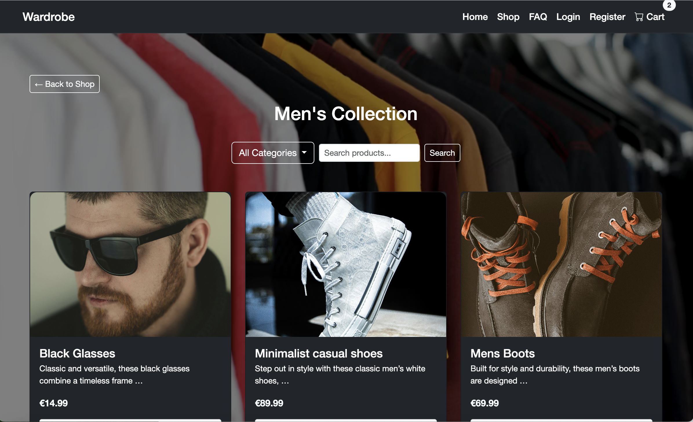

# Wardrobe 🛍️

**Wardrobe** is a fully responsive, full-stack e-commerce platform built with Django, Bootstrap, and Stripe.  
It enables secure online shopping, real-time cart updates, and streamlined order tracking via a custom admin dashboard.

🔗 **Live Site:** https://wardrobe-project-2025-a1e1d4253e40.herokuapp.com/  
💻 **GitHub:** https://github.com/martiiann/wardrobe-project

---

## 📱 Responsive Overview

| Mobile View | Tablet View | Desktop View |
|-------------|-------------|--------------|
|  |  |  |
|  |  |  |

---

## 🧭 Page Overviews
### 🏠 Home Page

### 🛍️ Shop Page

### 🛒 Cart Page

### 💳 Checkout Page

### 📦 Order History

### 👤 Profile Page

### ⚙️ Admin Dashboard

---

## 🧩 Wireframes
| Page              | Wireframe |
|-------------------|-----------|
| Home              |  |
| Shop (Product Detail) |  |
| Cart              |  |
| Checkout          |  |

---

## 🗃️ Database Design (ERD)

---

## 🔄 User Flow Diagram

---

## ✨ Features
- 🔐 **Authenticate** — Secure registration, login, and logout
- 🛍️ **Browse** — Shop by gender and category with responsive product cards
- 📄 **Product Details** — View product descriptions, prices, availability, and select sizes
- 🛒 **Live Cart Updates** — Add, update, and remove items with instant cart count updates
- 💳 **Checkout Securely** — Stripe integration for safe, fast transactions
- 📦 **Track Orders** — Order history and tracking number display
- 🖥 **Custom Admin Panel** — Manage products, orders, and tracking in a tailored dashboard
- 📱 **Responsive by Design** — Optimized for mobile, tablet, and desktop

---

## 🛠 Technical Stack
**Frontend:** HTML5, CSS3, JavaScript (ES6), Bootstrap  
**Backend:** Python 3, Django 5  
**Database:** PostgreSQL  
**Payments:** Stripe API  
**Hosting & Storage:** Heroku, Cloudinary  
**Version Control:** Git, GitHub

---

## 🧮 Functionality Overview
| Feature              | Description                                              |
|----------------------|----------------------------------------------------------|
| Add to Cart          | Add from product page or shop view                       |
| Update Quantity      | Adjust quantity in cart using + / −                      |
| Remove from Cart     | Remove individual items                                  |
| Checkout with Stripe | Secure payment via Stripe API                            |
| Order History        | View all past orders with details                        |
| Tracking Number      | Admin adds tracking; user sees it instantly              |
| Live Cart Updates    | Cart count updates instantly                             |
| Admin Panel          | Full product & order management                          |

---

## ✅ Manual Testing

📋 Click to view Manual Testing Table

| Feature                    | Test Description                         | Expected Outcome                              | Status |
|---------------------------|-------------------------------------------|-----------------------------------------------|--------|
| Register User             | Create account                            | Success message, redirect                     | ✅ Pass |
| Invalid Registration      | Submit empty/invalid form                 | Errors displayed, no account created          | ✅ Pass |
| Login                     | Enter valid credentials                   | Logged in, redirect to shop                   | ✅ Pass |
| Invalid Login             | Enter wrong password                      | Error message, no login                       | ✅ Pass |
| Add to Cart               | Add from shop and product detail          | Item appears in cart, toast shown             | ✅ Pass |
| Update Quantity           | Use + / - on cart page                    | Quantity updates, totals recalculated         | ✅ Pass |
| Remove from Cart          | Remove an item                            | Item removed, totals recalculated             | ✅ Pass |
| Empty Cart Checkout       | Attempt checkout with no items            | Prevented with warning                        | ✅ Pass |
| Stripe Success            | Pay with valid test card                  | Payment success, order created, email sent    | ✅ Pass |
| Stripe Failure            | Use failing test card                     | Payment fails, no order created               | ✅ Pass |
| Out-of-Stock Product      | Add unavailable size                      | Disabled button / alert shown                 | ✅ Pass |
| Order History             | View order list                           | Orders render with correct fields             | ✅ Pass |
| Tracking Number Visibility| Admin adds tracking                       | Tracking shown on user order detail           | ✅ Pass |
| Auth-Protected Views      | Visit profile/history while logged out    | Redirect to login                             | ✅ Pass |
| Responsive Layout         | iPhone / iPad / Desktop                   | Layout adapts without overflow                | ✅ Pass |

---

## 🧪 Validator & Automated Testing

💻 Click to view Validation & Automated Testing Screenshots

### HTML Validation
  
  
  

### CSS Validation

### JavaScript Validation

### Python Validation  
All Python code validated with the Code Institute Python Linter — no errors.

**Admin Tests**  
  
  
  

**Cart Tests**  
  
  
  

**Orders Tests**  
  
  
  
  

**Products Tests**  
  
  
  

**Wardrobe App Tests**  
  
  
  
  
  

---

## 🚀 Performance

- **Performance:** 95%  
- **Accessibility:** 90%  
- **Best Practices:** 94%  
- **SEO:** 92%  

---

## 💡 Future Features
- Wishlist  
- Product reviews & ratings  
- Discount codes  
- Advanced search  

---

## 🛠️ Deployment
The project was deployed on **Heroku** with:
- PostgreSQL for database  
- Cloudinary for media storage  
- Stripe for payments  
- GitHub for version control

---
