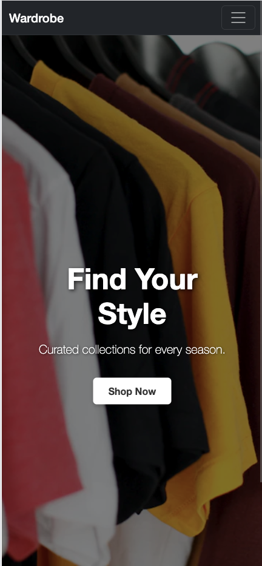

# Wardrobe 🛍️


**Wardrobe** is a fully responsive, full-stack e-commerce platform built with Django, Bootstrap, and Stripe.  
It enables secure online shopping, real-time cart updates, and streamlined order tracking via a custom admin dashboard.

🔗 **Live Site:** https://wardrobe-project-2025-a1e1d4253e40.herokuapp.com/  
💻 **GitHub:** https://github.com/martiiann/wardrobe-project

---

## 📑 Table of Contents
1. [Responsive Overview](#responsive-overview)
2. [Page Overviews](#page-overviews)
3. [Wireframes](#wireframes)
4. [Database Design](#database-design-erd)
5. [User Flow Diagram](#user-flow-diagram)
6. [Features](#features)
7. [Technical Stack](#technical-stack)
8. [Functionality Overview](#functionality-overview)
9. [First-Time & Returning Visitor Goals](#first-time--returning-visitor-goals)
10. [Design](#design)
11. [Devices Tested](#devices-tested)
12. [Manual Testing](#manual-testing)
13. [Additional Testing](#additional-testing)
14. [Validator & Automated Testing](#validator--automated-testing)
15. [Performance](#performance)
16. [User Feedback](#user-feedback)
17. [Future Features](#future-features)
18. [Debugging & Problem Solving](#debugging--problem-solving)
19. [Deployment](#deployment)
20. [Lessons Learned](#lessons-learned)
21. [Acknowledgments](#acknowledgments)

---

## 📱 Responsive Overview

| Mobile View | Tablet View | Desktop View |
|-------------|-------------|--------------|
|  |  |  |
|  |  |  |

---

## 🧭 Page Overviews
### 🏠 Home Page


### 🛍️ Shop Page


### 🛒 Cart Page


### 💳 Checkout Page


### 📦 Order History


### 👤 Profile Page


### ⚙️ Admin Dashboard


---

## 🧩 Wireframes
| Page              | Wireframe |
|-------------------|-----------|
| Home              |  |
| Shop (Product Detail) |  |
| Cart              |  |
| Checkout          |  |

---

## 🗃️ Database Design (ERD)


---

## 🔄 User Flow Diagram


---

## ✨ Features
- 🔐 **Authenticate** — Secure registration, login, and logout
- 🛍️ **Browse** — Shop by gender and category with responsive product cards
- 📄 **Product Details** — View product descriptions, prices, availability, and select sizes
- 🛒 **Live Cart Updates** — Add, update, and remove items with instant cart count updates
- 💳 **Checkout Securely** — Stripe integration for safe, fast transactions
- 📦 **Track Orders** — Order history and tracking number display
- 🖥 **Custom Admin Panel** — Manage products, orders, and tracking in a tailored dashboard
- 📱 **Responsive by Design** — Optimized for mobile, tablet, and desktop

---

## 🛠 Technical Stack
**Frontend:** HTML5, CSS3, JavaScript (ES6), Bootstrap  
**Backend:** Python 3, Django 5  
**Database:** PostgreSQL  
**Payments:** Stripe API  
**Hosting & Storage:** Heroku, Cloudinary  
**Version Control:** Git, GitHub

---

## 🧮 Functionality Overview
| Feature              | Description                                              |
|----------------------|----------------------------------------------------------|
| Add to Cart          | Add from product page or shop view                       |
| Update Quantity      | Adjust quantity in cart using + / −                      |
| Remove from Cart     | Remove individual items                                  |
| Checkout with Stripe | Secure payment via Stripe API                            |
| Order History        | View all past orders with details                        |
| Tracking Number      | Admin adds tracking; user sees it instantly              |
| Live Cart Updates    | Cart count updates instantly                             |
| Admin Panel          | Full product & order management                          |

---

## 🎯 First-Time & Returning Visitor Goals
**First-Time Visitors**
- Quickly understand the site purpose.
- Browse products easily by category.
- Add products to cart and checkout without confusion.
- Trust the payment process (secure Stripe checkout).

**Returning Visitors**
- Log in and see previous orders.
- Track current orders with a tracking number.
- Update saved profile details for faster checkout.

---

## 🎨 Design
The design follows a **modern, minimalist e-commerce style** with:
- Bootstrap 5 for responsive grid and components.
- Consistent color palette for branding.
- Rounded product cards and buttons for a friendly, accessible UI.
- Toast notifications for user feedback.
- Mobile-first approach for accessibility.

---

## 📱 Devices Tested
The site was tested on:
- **Mobile:** iPhone 12, iPhone 16 Pro, Samsung Galaxy S25
- **Tablet:** iPad 9th Gen, Samsung Galaxy Tab A
- **Laptop/Desktop:** Windows 11 (Edge, Chrome, Firefox), macOS (Safari, Chrome)
- Browser developer tools used for simulated resolutions.

---

## ✅ Manual Testing

<details>
<summary>📋 Click to view Manual Testing Table</summary>

| Feature                    | Test Description                         | Expected Outcome                              | Status |
|---------------------------|-------------------------------------------|-----------------------------------------------|--------|
| Register User             | Create account                            | Success message, redirect                     | ✅ Pass |
| Invalid Registration      | Submit empty/invalid form                 | Errors displayed, no account created          | ✅ Pass |
| Login                     | Enter valid credentials                   | Logged in, redirect to shop                   | ✅ Pass |
| Invalid Login             | Enter wrong password                      | Error message, no login                       | ✅ Pass |
| Add to Cart               | Add from shop and product detail          | Item appears in cart, toast shown             | ✅ Pass |
| Update Quantity           | Use + / - on cart page                    | Quantity updates, totals recalculated         | ✅ Pass |
| Remove from Cart          | Remove an item                            | Item removed, totals recalculated             | ✅ Pass |
| Empty Cart Checkout       | Attempt checkout with no items            | Prevented with warning                        | ✅ Pass |
| Stripe Success            | Pay with valid test card                  | Payment success, order created, email sent    | ✅ Pass |
| Stripe Failure            | Use failing test card                     | Payment fails, no order created               | ✅ Pass |
| Out-of-Stock Product      | Add unavailable size                      | Disabled button / alert shown                 | ✅ Pass |
| Order History             | View order list                           | Orders render with correct fields             | ✅ Pass |
| Tracking Number Visibility| Admin adds tracking                       | Tracking shown on user order detail           | ✅ Pass |
| Auth-Protected Views      | Visit profile/history while logged out    | Redirect to login                             | ✅ Pass |
| Responsive Layout         | iPhone / iPad / Desktop                   | Layout adapts without overflow                | ✅ Pass |

</details>

---

## 🧪 Additional Testing
**CRUD Testing**
- Create, read, update, delete operations tested for:
  - Products (admin panel)
  - Orders (admin panel & user views)
  - Profile (user can update address/payment info)
- All CRUD actions perform correctly with success messages.

**Form Validation**
- Registration/login forms prevent invalid submissions.
- Checkout form validates required fields before Stripe session.

---

## 🧪 Validator & Automated Testing

<details>
<summary>💻 Click to view Validation & Automated Testing Screenshots</summary>

### HTML Validation
  
  
  


### CSS Validation


### JavaScript Validation


### Python Validation  
All Python code validated with the Code Institute Python Linter — no errors.

**Admin Tests**  
  
  
  

**Cart Tests**  
  
  

**Orders Tests**  
  
  
  
  

**Products Tests**  
  
  
  

**Wardrobe App Tests**   
  
  
  
  

</details>

---

## 🚀 Performance


- **Performance:** 99%  
- **Accessibility:** 100%  
- **Best Practices:** 100%  
- **SEO:** 90%  

---

## 🔔 User Feedback
Feedback was gathered from testers and early users:
- **Positive:** Clear navigation, fast checkout, mobile-friendly design.
- **Improvements suggested:** Add wishlist, product reviews, and more payment options.
- **Action taken:** Wishlist and reviews added to “Future Features”.

---

## 💡 Future Features
- Wishlist  
- Product reviews & ratings  
- Discount codes  
- Advanced search  

---

## 🐞 Debugging & Problem Solving
During development:
- **Stripe Webhook Issue:** Orders not appearing after redirect → solved by ensuring webhook creates order before redirect.
- **CSS Overflow on Mobile:** Fixed with `overflow-x: hidden` and responsive grid adjustments.
- **Duplicate Toast Messages:** Consolidated alert logic to prevent repeats.
- **Heroku Static Files Issue:** Solved by setting correct `STATIC_ROOT` and running `collectstatic`.

---

## 🛠️ Deployment

The Wardrobe project was deployed to [Heroku](https://www.heroku.com/) using the following process:

### 🔧 Local Setup & Cloning

1. Cloning the Repository  
Open a terminal and run:  
 ```bash
   git clone https://github.com/martiiann/wardrobe-project.git
   cd wardrobe-project

2. Create and Activate a Virtual Environment  
`python3 -m venv venv`  
`source venv/bin/activate` (Unix/Mac)  
`venv\Scripts\activate` (Windows)

3. Install Required Dependencies  
`pip install -r requirements.txt`

4. Set Up Environment Variables  
Create an `env.py` file with the following:  
```python
import os  
os.environ['SECRET_KEY'] = 'your_secret_key'  
os.environ['DATABASE_URL'] = 'your_postgres_url'  
os.environ['CLOUDINARY_URL'] = 'your_cloudinary_url'  
```

5. Database Setup  
`python manage.py makemigrations`  
`python manage.py migrate`

6. Create a Superuser  
`python manage.py createsuperuser`

7. Collect Static Files  
`python manage.py collectstatic`

---

### ☁️ Heroku Deployment Steps

1. Create a New Heroku App  
Go to the Heroku dashboard → "New" → "Create new app" → set your app name and region.

2. Connect GitHub Repository  
Under the Deploy tab, connect to GitHub and select the repository.

3. Set Config Vars  
In the Heroku dashboard, go to Settings → Config Vars. Add the following:  
- `SECRET_KEY`  
- `DATABASE_URL`  
- `CLOUDINARY_URL`

4. Push to Heroku  
Run the following:  
`git push heroku main`

5. Disable Debug and Set Allowed Hosts  
In `settings.py`, make sure the following are set:  
```python
DEBUG = False  
ALLOWED_HOSTS = ['wardrobe-project-2025-a1e1d4253e40.herokuapp.com', 'localhost']  
```

6. Final Checks  
Ensure there is no commented-out code.  
Confirm flash messages work on login, logout, and CRUD actions.  
Test all user functionality, static/media files, and responsiveness on Heroku.

---

### 🌐 Live Site

🔗 **Live Site:** https://wardrobe-project-2025-a1e1d4253e40.herokuapp.com/  
💻 **GitHub:** https://github.com/martiiann/wardrobe-project

---

## 📚 Lessons Learned

Throughout the development of **Wardrobe**, I gained valuable technical and problem-solving experience:

- **Full E-Commerce Workflow**  
  Learned how to plan, design, and implement a complete online store with secure payments, order management, and responsive design.

- **Stripe Integration & Webhooks**  
  Understood the importance of creating orders only after confirmed payment events, and how to handle asynchronous webhook responses to avoid duplicate orders.

- **Custom Admin Dashboard**  
  Developed a tailored admin interface for product and order management, improving UX over Django’s default admin.

- **Responsive & Accessible Design**  
  Built a mobile-first layout with Bootstrap, tested across multiple devices, and ensured accessibility compliance.

- **Session-Based Cart**  
  Implemented a persistent, session-based cart system and learned the importance of handling edge cases like out-of-stock items and size selection.

- **Debugging in Production**  
  Gained experience using `heroku logs --tail` and browser dev tools to identify and fix deployment-specific issues.

- **Environment Variable Management**  
  Understood the security benefits of keeping keys and secrets outside the codebase, and configuring them correctly in both local and production environments.

- **Testing**  
  Strengthened skills in automated Django testing and manual feature validation to ensure reliability across features.

These lessons have improved my ability to structure complex Django applications and deploy production-ready, user-friendly web apps.

---

**If I had more time**, I would:
- Implement a **wishlist** feature so users can save products for later.  
- Add **product reviews & ratings** for better customer feedback.  
- Introduce **discount codes** and limited-time offers.  
- Build **advanced product search** with filtering by price, size, and availability.  
- Create a **recommendation system** based on user purchase history.

---

## Acknowledgments
- Special thanks to my mentors **Marko** and **Moritz** for their invaluable guidance throughout my project.
- I would like to thank the tutor support team at **Code Institute** for their assistance.
- A big thank you to the entire **Code Institute** for providing me with the opportunity to attend this course and work on this project.